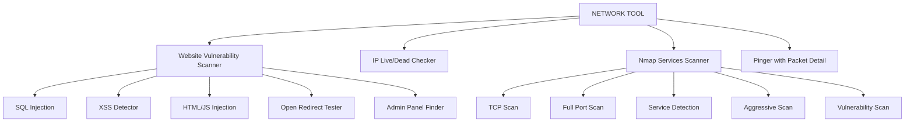
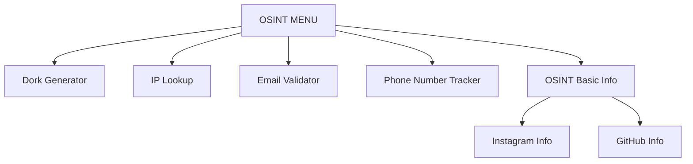
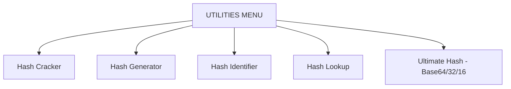

<p align="center">
  
</p>

<h1 align="center">🛡️ MONOLITH - Ethical Hacking Toolkit</h1>
<p align="center">
  🇧🇩 Developed by <b>BLACK ZERO</b><br>
  🚀 Powered by <b>BANGLADESH CYBER SQUAD ✘ TEAM SHADOW STRIKER</b><br>
  📆 Year: 2025
</p>

---

## 📦 Features

- 🌐 Network Tools (SQLi, XSS, Admin Finder, Nmap, IP Ping)
- 🔍 OSINT Tools (Dork Generator, IP Lookup, Email Validator, Phone Tracker)
- 🛠️ Hash Utilities (Cracker, Generator, Identifier, Decrypter)
- 📸 Picture Payload Toolkit (Coming Soon)
- 👤 Identity Login + Secure Tracker
- ⚡ Beautiful Terminal UI using Rich Library

---

## 🔐 Login Flow

```mermaid
flowchart TD
    A[🔐 Start Toolkit] --> B{Check Identity Exists?}
    B -- Yes --> C[Prompt Username & Team]
    C --> D{Correct Match?}
    D -- Yes --> E[✅ Logged In & Count++]
    D -- No --> F[❌ Exit Toolkit]
    B -- No --> G[🆕 Ask Username & Team]
    G --> H[Create Identity + UID]
````

---

## 🧰 Main Menu Flow

```mermaid
flowchart TD
    A[MAIN MENU] --> B[NETWORK TOOL]
    A --> C[OSINT TOOLS]
    A --> D[UTILITIES]
    A --> E[ADVANCED TOOLKIT]
    A --> F[ATTACK TOOL]
    A --> G[PICTURE TOOLKIT]
    A --> H[RESET IDENTITY]
    A --> I[DEVELOPER INFO]
```
---

## 🌐 NETWORK TOOL MENU



---

## 🕵️ OSINT TOOL MENU



---

## 🔐 UTILITIES MENU



---

## 🧪 Installation (Termux)

```bash
pkg update && pkg upgrade
pkg install python git -y
pkg install tesseract
pip install pytesseract
pkg install jp2a
pkg install python3 
git clone https://github.com/TEAMBCS/MONOLITH.git
cd MONOLITH
chmod +x *
python3 setup.py
python3 monolith.py
```

---
## 🥷 Indetity Restore
```bash
if you forget your own username and team name then use python3 indenty_restore.py
```
---
## 💡 Usage Example

```bash
$ python3 monolith.py
🔐 Login with username and team name
📡 Choose any module from main menu
🛠️ Enjoy hacking ethically!
```

---

## 👨‍💻 Developer

* 👤 Name: BLACK ZERO
* 💼 Team: BANGLADESH CYBER SQUAD ✘ TEAM SHADOW STRIKER
* 🌐 Website: [black-zero.vercel.app](https://black-zero.vercel.app)

---

## ⚠️ Warning

```
❗ This toolkit is for educational and ethical use only.
❗ We are not responsible for any misuse or illegal activities.
```

---

## 📜 License

```
MIT License - Free to use, modify and share.
```


